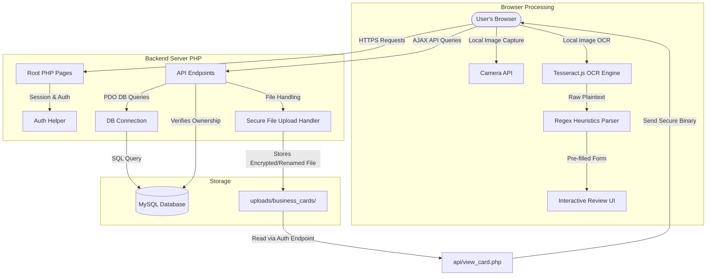

# CARDVAULT Architecture

## System Overview
CardVault is a self-contained, traditional PHP application built for cPanel Shared Hosting environments. It serves as a mobile-first Business Card Scanner and a Personal CRM.

## Key Architectural Decisions

### 1. Browser-Side OCR
- **Why**: Shared hosting environments lack root permissions and the CPU/RAM profiles required for server-side OCR (e.g., Tesseract CLI or Node.js services).
- **How**: Tesseract.js is loaded from a CDN. Image processing and OCR happen entirely on the user's browser, eliminating CPU overhead on the hosting server.
- **Self-Hosting Capability**: The OCR modules are architected so that the CDN URLs for Tesseract.js worker scripts can be changed to local web paths in configuration without modifying backend PHP code or JS logic.

### 2. Multi-User Ownership
- **Principle**: The database schema is fully normalized and user-segmented.
- **SQL Enforced Security**: Rather than relying on simple checks (e.g., checking if contact exists, then checking owner in PHP code), every SQL query combines the resource ID and session `user_id`. This prevents ID-harvesting and direct object reference (IDOR) attacks.
  - *Example*: `SELECT * FROM contacts WHERE id = ? AND user_id = ?`

### 3. File Security and Image Storage
- **Principle**: Uploaded card images are not exposed directly in public directories.
- **Implementation**:
  - Uploaded files are placed in `uploads/business_cards/` with random unique hashes (e.g., `md5(uniqid())`) and the extension forced to valid image types.
  - A highly restrictive `.htaccess` is placed in the uploads folder to prevent execution of PHP scripts.
  - Images are served strictly through an authenticated file gateway `api/view_card.php?id=<contact_id>`. This gateway verifies that the logged-in session user owns the requested contact before loading and streaming the image from disk.

### 4. Zero-Dependency Core
- **Why**: Ensures immediate deployment capability to shared hosting without SSH/Composer.
- **How**: Backend uses standard PHP 8+ language features and PDO extension. Frontend uses CSS variables, Flexbox/Grid, and Vanilla JS.
