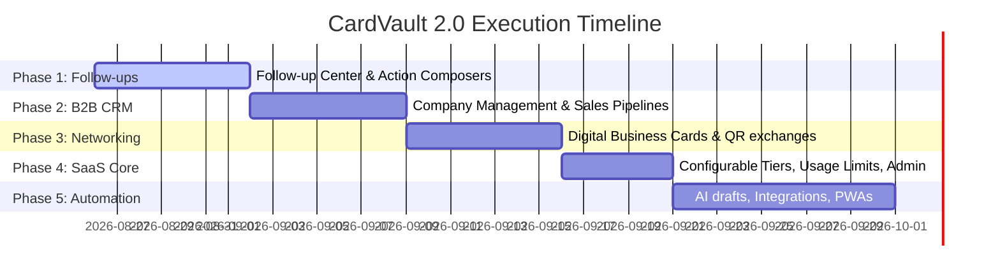

# CardVault 2.0 - Prioritized Product Roadmap

This document outlines the product roadmap, database/API impacts, and phase-by-phase implementation plan for transitioning **CardVault** from a simple scanning tool into a comprehensive Personal Relationship CRM and SaaS product.

---

## 1. Feature Inventories

### Current Feature Inventory (What Exists)
*   **Authentication**: Multi-user registration, login/logout, session tracking, CSRF protection, and SQL-enforced user isolation.
*   **Scanning Workflow**: Browser-side OCR using Tesseract.js via CDN, heuristics-based parsing, original business card image storage with secure file download gateway (`api/view_card.php`).
*   **CRM Core**: Contact CRUD, search, status tracking, date met, place met, tag attachments, dynamic dashboard directory list, and note creation.
*   **P1 CRM Additions**:
    *   Chronological relationship timeline UI on `contact.php`.
    *   Activity logs for Call, WhatsApp, and Email click events.
    *   `industry` and `lead_source` category attributes.
    *   Search matching tags, notes, and locations.
    *   Distinct industry and source dynamic filter dropdowns.
    *   Versioned database schema migration tool (`database/migrate.php`).

### Missing Feature Inventory (To Be Built)
*   **Follow-up Engine**: Overdue/Today/Upcoming summary counters, snooze tools, status completions, reusable contact follow-up sequences.
*   **Communication Composers**: WhatsApp wa.me composer with prepopulated templates; mailto: email composer.
*   **Public Digital Business Cards**: Public slugs, private field control, vCard (VCF) downloads, visitor-to-owner contact exchange system.
*   **B2B CRM Entities**: Companies/Organizations module (`companies.php` and `company.php`) grouping associated contacts.
*   **Kanban Sales Pipeline**: Dynamic pipeline stages with value-weighted opportunity trackers.
*   **Networking Event Mode**: Event lists and event-associated scan grouping.
*   **SaaS Infrastructure**: Pricing page, configurable plans, billing UI dashboards, usage limiters, and admin panels.

---

## 2. Prioritized Roadmap & Phased Execution

Proposed features are classified into five priority tiers based on core product value and monetization potential:

### Phase 1: Follow-up Center & Action Composers (P0 / P1)
*   **follow-ups.php (P0)**: Separate follow-up dashboard page grouped by Overdue, Today, Tomorrow, This Week, and Upcoming. Includes quick actions for Call, WhatsApp, Email, Snooze, Edit, and Complete.
*   **Templates & Composers (P1)**: Prepopulated WhatsApp templates and HTML email configurations with database timeline integration logging.
*   **Sequences (P1)**: Multi-step follow-up pipelines (e.g. Day 1: WhatsApp, Day 3: Email, Day 7: Call).
*   **Today's Actions & Start My Day (P1)**: Focused task walkthrough guiding the user sequentially through priority notifications.

### Phase 2: B2B CRM & Opportunities (P2)
*   **Company Management (P2)**: `companies.php` and `company.php` grouping contacts under a shared organization, showing aggregate timelines and active follow-ups.
*   **Sales Pipeline Kanban (P2)**: Visual sales pipeline board mapping contact progression through CRM stages.
*   **Value Opportunities (P2)**: Dollar values, win probabilities, and expected close dates tied to contacts and companies.

### Phase 3: Digital Business Cards & Networking Utility (P1 / P2)
*   **Digital Business Card (P1)**: User editor profile (`my-card.php`) generating public digital card profile page (`c/unique-slug`).
*   **vCard Engine (P1)**: Tapping "Save Contact" downloads a formatted `.vcf` file with proper escapes.
*   **Contact Exchange (P2)**: Public-facing form allowing visitors to exchange details, creating a lead for the card owner.
*   **QR Generator (P2)**: Dynamic QR redirect pointing to the owner's public card profile.

### Phase 4: SaaS Foundation & Usage Limits (P1)
*   **Pricing Page (P1)**: SaaS pricing page displaying Free, Pro, Pro AI, and Business tiers.
*   **Usage Enforcer (P1)**: Tracks scan counts and total contacts. Gracefully blocks additions when limits are reached, showing upgrade CTAs.
*   **Admin Dashboard (P1)**: Secure portal to manage users, plans, active subscriptions, usage counts, and system metrics.

### Phase 5: AI Layer & Future Integrations (P3 / P4)
*   **Voice Notes (P3)**: HTML5 recording transcribing contact summaries.
*   **Third-Party Sync (P3)**: Import/Export pipelines (CSV, Excel, vCard) and Google Contacts API connectors.
*   **AI Relationship Health (P4)**: Dynamic relationship scores computed using interaction frequencies, follow-up completions, and inactivity triggers.

---

## 3. Technical Impact Analysis

### Database Impact
New relational tables and schema columns will be introduced:
1.  **`companies`**: `id`, `user_id`, `name`, `industry`, `website`, `city`, `state`, `country`, `created_at` (1-to-many relationship with contacts).
2.  **`opportunities`**: `id`, `contact_id`, `company_id`, `user_id`, `name`, `value`, `probability`, `expected_close_date`, `stage`, `notes`, `created_at`.
3.  **`events`**: `id`, `user_id`, `name`, `event_date`, `location`, `description`, `created_at`.
4.  **`user_profile_cards`**: `id`, `user_id`, `slug` (unique), `full_name`, `designation`, `company`, `phone`, `email`, `website`, `linkedin_url`, `bio`, `profile_photo`, `public_fields` (JSON configuration).
5.  **`follow_up_schedules`**: `id`, `contact_id`, `user_id`, `due_date`, `priority` (High/Medium/Low), `status` (Pending/Completed), `notes`, `created_at`.

### API Impact
*   `api/followup.php`: Complete, snooze, or schedule follow-up items.
*   `api/digital_card.php`: Handles public card contact exchange form submissions and generates vCard `.vcf` headers.
*   `api/pipeline.php`: Updates Kanban stages via drag-and-drop.
*   `api/events.php`: Associates scanned contacts with active events.
*   `api/billing.php`: Tracks active tier usage and limits.

### Security Impact
*   **CSRF Enforcement**: Every state-changing form (including snooze, complete follow-up, and public contact exchange) must validate CSRF tokens.
*   **Segmented User Ownership**: SQL queries in new endpoints (pipeline, companies, events) must explicitly query `AND user_id = :user_id` to maintain strict isolation.
*   **Public Page Protection**: The `/c/` profile page must perform strict input sanitation to prevent XSS/SQL injections on the public slug parameter.

---

## 4. Phase-by-Phase Implementation Complexity

| Phase | Estimated Complexity | Core Deliverables | Target Timeline |
| :--- | :--- | :--- | :--- |
| **Phase 1** | **Medium** | Follow-up center, snooze API, WhatsApp templates, today's actions dashboard list | 7 Days |
| **Phase 2** | **Medium** | B2B Company pages, Kanban pipeline layout, opportunity weighted values | 7 Days |
| **Phase 3** | **High** | Public profiles, vCard downloads, QR code generation, guest contact exchanges | 7 Days |
| **Phase 4** | **Medium** | SaaS pricing models, billing limits checks, admin system health panel | 5 Days |
| **Phase 5** | **High** | voice notes, CSV import/export mapping engine, third-party api syncs | 10 Days |
