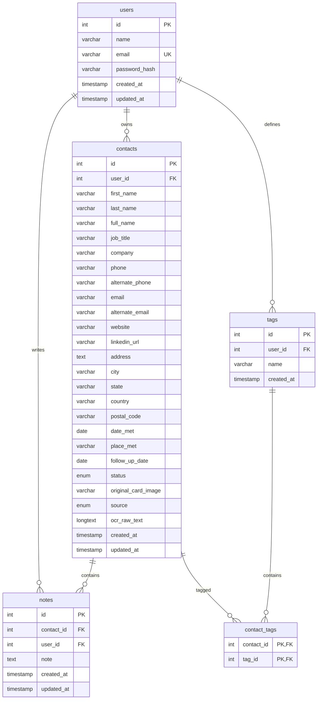

# Database Design

CardVault uses a normalized MySQL database structure designed for secure multi-user partitioning.

## Schema Diagram



## Table Specifications & Indexing Strategy

### 1. `users`
- Stores user credentials.
- Index: Unique index on `email` to allow fast lookup on login and guarantee unique accounts.

### 2. `contacts`
- Primary business card data.
- Foreign Key: `user_id` pointing to `users.id` with `ON DELETE CASCADE`.
- Indexes:
  - `idx_user_contacts` on `user_id`: Crucial for partitioning queries per user.
  - `idx_contact_name` on `full_name`: Search optimization.
  - `idx_contact_email` on `email`: Search & duplicate checking optimization.
  - `idx_contact_phone` on `phone`: Search & duplicate checking optimization.
  - `idx_contact_company` on `company`: Search optimization.
  - `idx_follow_up` on `(user_id, follow_up_date, status)`: Optimization for dashboard follow-up query alerts.

### 3. `notes`
- Stores notes associated with contacts.
- Foreign Keys: `contact_id` pointing to `contacts.id` (`ON DELETE CASCADE`), and `user_id` pointing to `users.id` (`ON DELETE CASCADE`).
- Indexes:
  - `idx_contact_notes` on `contact_id`.
  - `idx_user_notes` on `user_id` (ensures ownership queries are indexed).

### 4. `tags`
- Stores user-defined custom categories (e.g. "Hotel", "Supplier").
- Foreign Key: `user_id` pointing to `users.id` (`ON DELETE CASCADE`).
- Unique Constraint: `uq_user_tag` on `(user_id, name)`: Ensures a user cannot create duplicate tags.

### 5. `contact_tags`
- Associative table mapping contacts to tags.
- Foreign Keys: `contact_id` (`ON DELETE CASCADE`) and `tag_id` (`ON DELETE CASCADE`).
- Primary Key: Composite key of `(contact_id, tag_id)`.

## SQL Level Authorization
Every query involving record access MUST include the owner's `user_id` as part of the query constraints:
```sql
-- Read Contact Details
SELECT * FROM contacts WHERE id = :contact_id AND user_id = :user_id;

-- Update Contact Details
UPDATE contacts SET first_name = :first_name, ... 
WHERE id = :contact_id AND user_id = :user_id;

-- Delete Contact Details
DELETE FROM contacts WHERE id = :contact_id AND user_id = :user_id;

-- Read Notes
SELECT * FROM notes WHERE contact_id = :contact_id AND user_id = :user_id ORDER BY created_at DESC;
```
This query pattern protects users from cross-tenant data leaks even in the event of logical bugs in the PHP routing layer.
